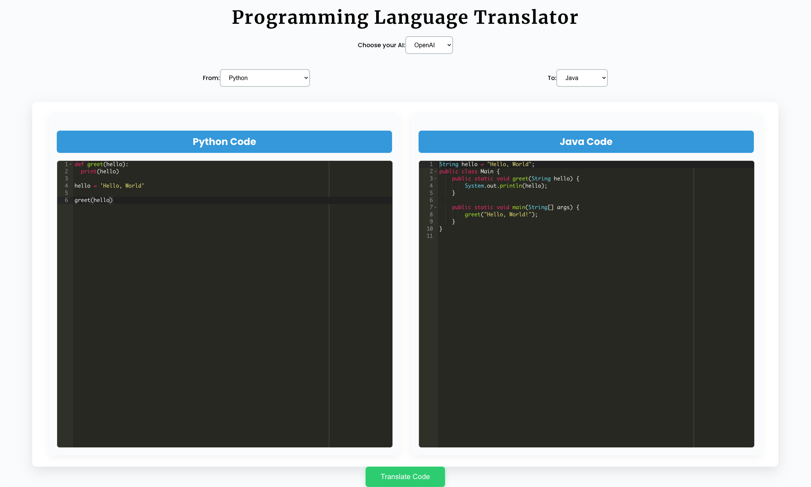

# Code Translator

Code Translator is a Python and React-based web application that allows users to translate code between multiple programming languages. The application leverages various AI models, including OpenAI's GPT-4, to perform language translation. Users can select source and target languages, input code, and receive the translated output in the desired language.



## Features

- **Multi-Language Translation**: Translate code between various programming languages such as Python, Java, C++, JavaScript, and many more.
- **Dynamic Language Selection**: The frontend dynamically filters available target languages based on the selected source language.
- **Segmentation**: Automatically divides code into logical segments such as imports, global variables, classes, functions, and the main block for more accurate translation.
- **Multiple AI Models**: Supports different AI models and APIs, including OpenAI, Groq, Ollama, Llama3.1, and a custom option.
- **REST API**: Exposes a `/api/translate` endpoint for sending code to the translator with specified source and target languages.
- **React Frontend**: Provides a user-friendly interface for submitting code and receiving translated output.
- **Flask Backend**: Powers the backend API, with support for CORS and integration with various AI models.
- **Modular Codebase**: Clean and maintainable code with modularization of language configurations and code segmentation logic.

## Tech Stack

- **Backend**: Flask, OpenAI API, Python
- **Frontend**: React, Axios, React Ace for code editing
- **Libraries**: `flask-cors`, `dotenv`, `re` (Regex), `concurrently` for running the React and Flask servers simultaneously.

## Installation and Setup

### Prerequisites

Ensure you have the following installed on your local machine:

- [Node.js](https://nodejs.org/)
- [Python 3.8+](https://www.python.org/)
- [OpenAI API Key](https://beta.openai.com/signup/) (Add this to your `.env` file if using OpenAI)
- Other API keys or configurations for Groq, Ollama, or Llama3.1 if you plan to use them.

### Clone the Repository

```bash
git clone https://github.com/your-username/code-translator.git
cd code-translator
```

### Backend (Python - Flask)

1. Create a virtual environment and activate it:

   ```bash
   python3 -m venv venv
   source venv/bin/activate  # On Windows: venv\Scripts\activate
   ```

2. Install the required dependencies:

   ```bash
   pip install -r requirements.txt
   ```

3. Set up your environment variables:

   Create a `.env` file in the root directory and add the necessary API keys:

   ```bash
   OPENAI_API_KEY=your-openai-api-key
   GROQ_API_KEY=your-groq-api-key          # If using Groq
   OLLAMA_API_KEY=your-ollama-api-key      # If using Ollama
   LLAMA3_API_KEY=your-llama3-api-key      # If using Llama3.1
   ```

4. Run the Flask server:

   ```bash
   python app.py
   ```

### Frontend (React)

1. Navigate to the `src` directory:

   ```bash
   cd src
   ```

2. Install the dependencies:

   ```bash
   npm install
   ```

3. Start the React application:

   ```bash
   npm run start
   ```

   This will start both the React and Flask servers simultaneously.

### Running the Application

Once both the Flask and React servers are running, open your browser and navigate to:

```
http://localhost:3000
```

You can now select source and target languages, enter code into the interface, and receive translations.

## Ollama Integration

Ollama can be used to translate code between different programming languages. Before using Ollama, you need to download and install it from the [Ollama website](https://ollama.com/download). Once installed, you can pull the required version of the Llama model, such as `llama3.1`, and integrate it into the translator.

### Installing Ollama

Follow these steps to install Ollama and set it up for use in this project:

1. Download and install Ollama from the official website:
   - [Ollama Download](https://ollama.com/download)

2. After installation, pull the required version of the model (e.g., `llama3.1`) by running the following command:
   ```bash
   ollama pull llama3.1

### References

- [Ollama Python GitHub Repository](https://github.com/ollama/ollama-python/tree/main)
- [Ollama Website](https://ollama.com/download)

## Supported Languages

The application supports a wide range of programming languages, including:

- **Common Languages**: Java, Python, C, C++, NodeJS, JavaScript, Groovy, JShell, Haskell, Tcl, Lua, Ada, Common Lisp, D, Elixir, Erlang, F#, Fortran, Assembly, Scala, PHP, Python2, C#, Perl, Ruby, Go, R, Racket, OCaml, Visual Basic (VB.NET), Basic, Bash, Clojure, TypeScript, Cobol, Kotlin, Pascal, Prolog, Rust, Swift, Objective-C, Octave, Brainfuck, CoffeeScript, EJS.

- **Database Query Languages**: MySQL, Oracle Database, PostgreSQL, MongoDB, SQLite, Redis, MariaDB, Oracle PL/SQL, Microsoft SQL Server.

- **Others**: Text, Sh.

**Note**: The availability of translations between specific languages may vary based on the capabilities of the AI models used.

## Usage

### Selecting Languages

- **From Language**: Select the source language of your code from the dropdown menu.
- **To Language**: After selecting the source language, the target language dropdown will automatically update to show only the languages that can be translated from the selected source language.

### Entering Code

- Use the left code editor to input your source code. The editor will adjust syntax highlighting based on the selected source language.

### Translating Code

- Click the **"Translate Code"** button to initiate the translation.
- The translated code will appear in the right code editor, with syntax highlighting for the target language.

### Choosing AI Model

- Use the **"Choose your AI"** dropdown to select which AI model or API you want to use for translation.

## Customization

### Adding New Languages

- **Frontend**: Update `language.js` to include the new language in the `languages` array and update `languageMappings` if necessary.
- **Backend**: Add a new segmentation function in `segments.py` for the new language and update the `segment_functions` mapping.

### Adding New AI Models

- Create a new translation module in the `translations` directory, similar to `translate_openai.py`.
- Implement the translation logic using the new AI model's API.
- Update the `get_translator` function in `translations/__init__.py` to include the new model.

## File Structure

```
code-translator/
│
├── app.py                # Flask API for code translation
├── segments.py           # Code segmentation logic for various languages
├── translations/         # Translation modules for different AI models
│   ├── __init__.py
│   ├── translate_openai.py
│   ├── translate_groq.py
│   ├── translate_ollama.py
│   ├── translate_llama3.py
│   └── ...               # Other translation modules
├── language.js           # Language configurations and mappings for the frontend
├── package.json          # NPM dependencies and scripts
├── requirements.txt      # Python dependencies
├── .env                  # API keys file (not included in the repo)
├── .gitignore            # Files to ignore in the repo
├── README.md             # Project documentation
├── src/                  # React frontend source code
│   ├── App.js            # Main React component
│   ├── App.css           # Styling for the React app
│   ├── index.js          # Entry point for React
│   └── ...               # Other React components and assets
└── output/               # Directory for output examples and images
```

## Contributing

Contributions are welcome! Please follow these steps:

1. Fork the repository.
2. Create a new branch for your feature or bug fix.
3. Make your changes and commit them with clear messages.
4. Submit a pull request to the `main` branch of the original repository.

## License

This project is licensed under the [GNU General Public License v3.0](LICENSE).

## Acknowledgements

- **OpenAI GPT-4**: For providing the language translation capabilities.
- **React Ace**: For the code editor components.
- **Flask**: For the backend framework.

## Contact

For any questions or suggestions, please open an issue on the GitHub repository or contact the maintainer.

---

**Note**: Ensure that you have the appropriate API keys and permissions to use the AI models and APIs integrated into this application. Some models may have usage limits or costs associated with them.

---