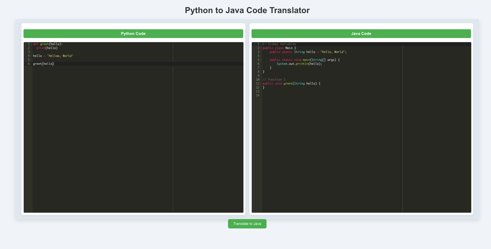

# Code Translator

Code Translator is a Python and React-based web application that allows users to translate Python code segments into Java. The application leverages the OpenAI GPT-4 model to perform language translation, taking in Python code as input and generating equivalent Java code output.

### Example Output

The following is an example of what you can expect as output from the application:



## Features

- **Python to Java Translation**: Seamlessly translates Python code segments into Java using the OpenAI API.
- **Segmentation**: Automatically divides Python code into logical segments such as imports, global variables, classes, functions, and the main block.
- **REST API**: Exposes a `/api/translate` endpoint for sending Python code to the translator.
- **React Frontend**: Provides a user-friendly interface for submitting Python code and receiving translated Java output.
- **Flask Backend**: Powers the backend API, with support for CORS and OpenAI integration.

## Tech Stack

- **Backend**: Flask, OpenAI API, Python
- **Frontend**: React, Axios, React Ace for code editing
- **Libraries**: `flask-cors`, `dotenv`, `re` (Regex), `concurrently` for running the React and Flask servers simultaneously.

## Installation and Setup

### Prerequisites

Ensure you have the following installed on your local machine:

- [Node.js](https://nodejs.org/)
- [Python 3.8+](https://www.python.org/)
- [OpenAI API Key](https://beta.openai.com/signup/) (Add this to your `.env` file)

### Clone the Repository

```bash
git clone https://github.com/your-username/code-translator.git
cd code-translator
```

### Backend (Python - Flask)

1. Create a virtual environment and activate it:

   ```bash
   python3 -m venv venv
   source venv/bin/activate  # On Windows: venv\Scripts\activate
   ```

2. Install the required dependencies:

   ```bash
   pip install -r requirements.txt
   ```

3. Set up your environment variables:

   Create a `.env` file in the root directory and add the OpenAI API key:

   ```bash
   OPENAI_API_KEY=your-openai-api-key
   ```

4. Run the Flask server:

   ```bash
   python app.py
   ```

### Frontend (React)

1. Install the dependencies:

   ```bash
   npm install
   ```

2. Start the React application:

   ```bash
   npm run start
   ```

   This will start both the React and Flask servers simultaneously.

### Running the Application

Once both the Flask and React servers are running, open your browser and navigate to:

```
http://localhost:3000
```

You can now enter Python code into the interface and receive Java translations.

## File Structure

```
code-translator/
│
├── app.py                # Flask API for code translation
├── package.json          # NPM dependencies and scripts
├── requirements.txt      # Python dependencies
├── .env                  # OpenAI API Key file (not included in the repo)
├── .gitignore            # Files to ignore in the repo
├── README.md             # Project documentation
└── src/                  # React frontend source code
```

## License

This project is licensed under the [GNU General Public License v3.0](LICENSE).
